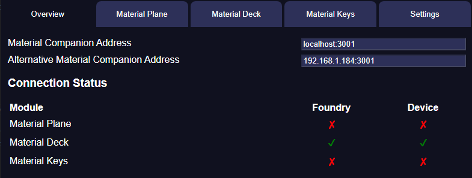

Material Companion is a companion app for the Material modules by Material Foundry:

* [Material Plane](https://github.com/MaterialFoundry/MaterialPlane)
* [Material Deck](https://github.com/MaterialFoundry/MaterialDeck)
* [Material Keys](https://github.com/MaterialFoundry/MaterialKeys)

The main purpose of Material Companion is to act as a bridge between your Foundry client and the hardware you want to connect to Foundry.

For Material Plane, this app can bridge the connection between the sensor and Foundry, since in some situations it is not possible to connect the sensor directly to the Foundry client (due to security restrictions). Additionally, Material Companion allows some configuration for the sensor and other Material Plane hardware, and it can be used to update the hardware.

Material Deck requires this app to connect a Stream Deck to the Foundry client. Material Companion is necessary because the Stream Deck application and Foundry client are otherwise not able to communicate (they can only run websocket clients, so a separate server is necessary).

For Material Keys, this app handles all MIDI communication and device management.

## Installation
Installation instructions [here](installation.md)

## Usage
{align=right width=50%}
The app is divided into several tabs:

* [Overview](overview.md) - Gives an overview of the current Material Companion status
* [Material Plane](materialPlane.md) - Allows the configuration of the Material Plane hardware
* [Material Deck](materialDeck.md) - Display data regarding Material Deck, and determine which Stream Decks are allowed to connect
* [Material Keys](materialKeys.md) - Configure which device connects to the Material Keys module
* [Settings](settings.md) - For configuring Material Companion

