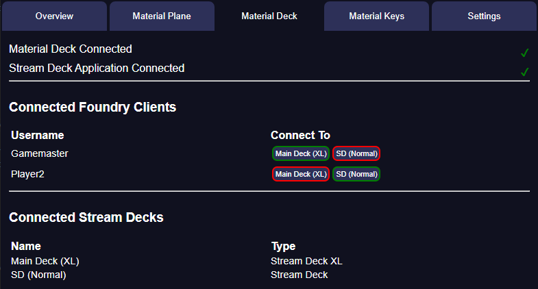

{align=right width=50%}
The Material Deck tab of Material Companion is divided into 3 sections. 

### Connection Status
At the top you can see if Material Companion has connected to the Stream Deck app and the Foundry module (see the [Material Deck documentation](https://github.com/MaterialFoundry/MaterialDeck/wiki) for info on how to configure the module).

### Connected Foundry Clients
The middle section displays the connected Foundry clients (users) and what Stream Deck they are connected to. Green means the Stream Deck is connected to that client, red means it is not. By clicking on them you can change this.

### Connected Stream Decks
The bottom section lists the Stream Decks connected to the computer.