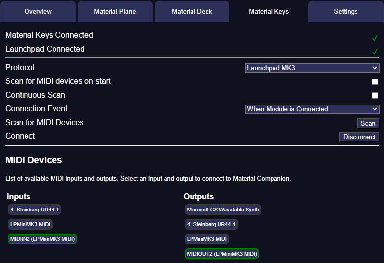

{align=right width=50%}
Material Companion handles all MIDI communication and device management for Material Keys. In this tab you can configure how this is handled.

## Connection Status
At the top you can see if Material Companion has connected to a MIDI device and the Foundry module (see the [Material Keys documentation](https://materialfoundry.github.io/MaterialKeys/) for info on how to configure the module).

## Settings
You can find the following settings:

* Device: Sets the device to use, see [here](https://materialfoundry.github.io/MaterialKeys/supportedDevices) for the supported devices
* Scan for MIDI Devices on Start: If ticked, Material Companion will scan for MIDI devices on start
* Continuous Scan: If ticked, Material Companion will continuously scan for changes in MIDI devices
* Connection Event: This sets when Material Companion will attempt to connect to the selected device, with the following options:
    * When Module is Connected: This will let Material Companion try to connect to the device as soon as Material Companion is connected to the Material Keys module
    * When Material Companion Starts: This will let Material Companion try to connect to the device as soon as Material Companion starts
    * Manually: This will only let Material Companion try to connect when you press the 'Connect' button
* Scan for MIDI Devices: Manually scan for MIDI devices
* Connect: Connect to the selected MIDI device

## MIDI Devices
Any detected MIDI devices are shown here. You can click on any of them to select them, which will turn them green. You have to select one input and one output for Material Keys to function.

When Material Keys tries to connect to a device, it will connect to the one selected here.