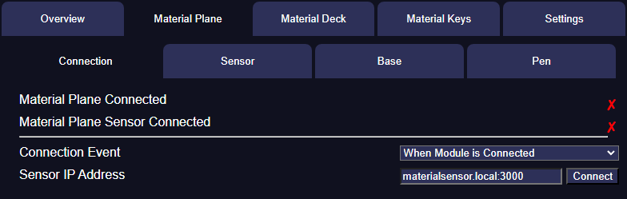
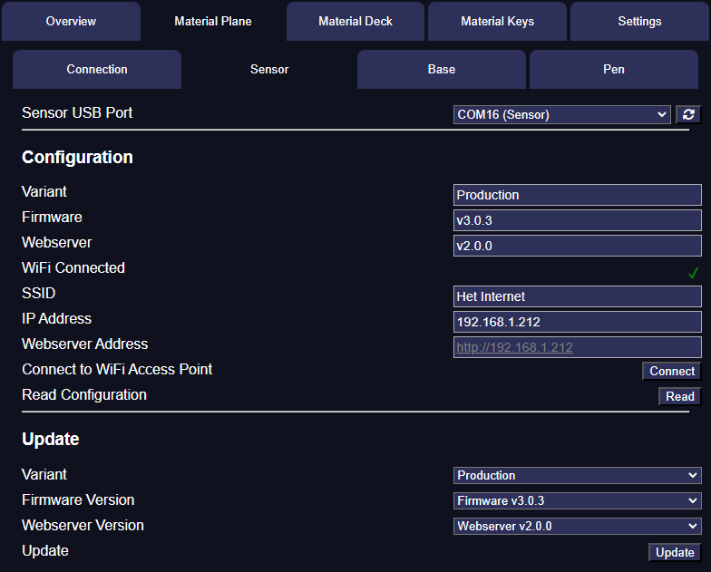
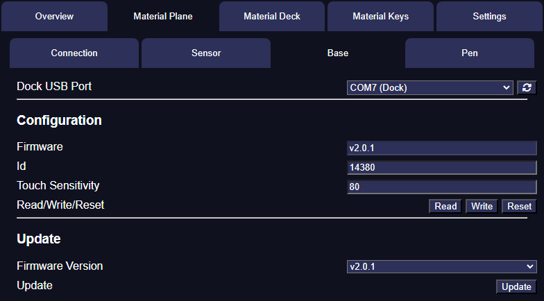
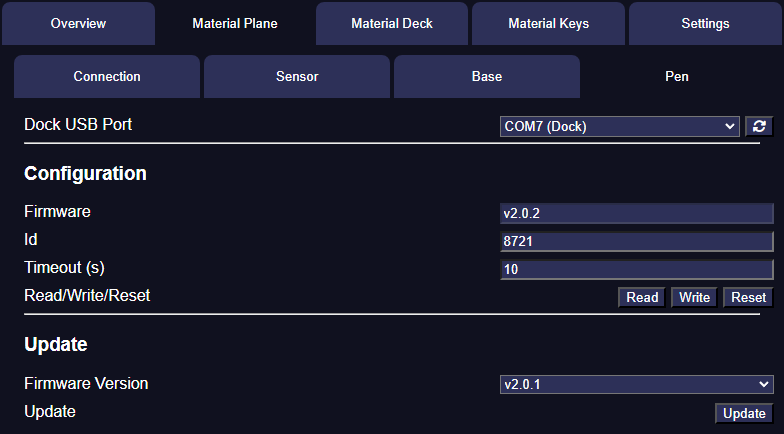

# Material Plane
The Material Plane tab allows you to update and configure the [Material Plane hardware](https://materialfoundry.github.io/MaterialPlane/Production/HardwareOverview/sensor/) and use Material Companion to connect the Foundry module to the sensor. 
This last option is required if your Foundry server is secured.

## Dependencies
Material Companion requires [Python 3.10](https://www.python.org/), [pip](https://pypi.org/project/pip/) and [pymcuprog](https://github.com/microchip-pic-avr-tools/pymcuprog) to write to and read from the Material Plane hardware. 
You will have to install Python yourself, but Material Companion will attempt to install pip and pymcuprog. If that fails, follow the installation instructions in the hyperlinks above to install them manually.

<b>Linux Users</b> 
The USB drivers for the dock do not work properly for some Linux distributions (such as Ubuntu 22.04). 
When calling `dmesg | grep tty` you might get a message like `ch341-uart converter now disconnected from ttyUSB0`, because the USB interface is claimed by brltty. 
Most users will not need brltty, so you can probably uninstall it: `sudo apt remove brltty`. 
You might also run into permission issues when Material Companion is trying to access a USB port: `Permission denied, cannot open /dev/ttyUSB0`. The easiest solution is to run `sudo chmod 666 /dev/ttyUSB0`.

## Overview
There are 4 tabs:

* [Connection](#connection) - For configuring the connection between Foundry and the sensor
* [Sensor](#sensor) - For updating and configuring the sensor
* [Base](#base) - For updating and configuring the base
* [Pen](#pen) - For updating and configuring the pen

## Connection
{align=right width=50%}
The connection tab is used to display and configure the connection between the Foundry module, sensor and Material Companion. This is used if a secured Foundry server is used or if the sensor can't connect directly to the Foundry client for another reason.

For instruction on how to configure Material Plane to do this, refer to the [Material Plane documentation](https://materialfoundry.github.io/MaterialPlane/Production/Foundry/foundryConnection/).

<b>Top Section</b> 
In the top section of the 'Connection' tab you can see if Material Companion has connected to the Material Plane module or the sensor.

<b>Bottom Section</b> 
In the bottom section of the 'Connection' tab you can find 2 settings:

* **Connection Event**: This sets when Material Companion will attempt to connect to the sensor, with the following options:
    * **When Module is Connected**: This will let Material Companion try to connect to the sensor as soon as Material Companion is connected to the Material Plane module
    * **When Material Companion Starts**: This will let Material Companion try to connect to the sensor as soon as Material Companion starts
    * **Manual**: This will only let Material Companion try to connect when you press the 'Connect' button in the 'Sensor IP Address' setting
* **Sensor IP Address**: The IP address of the sensor. By default this is `materialsensor.local:3000` but this can be configured on the [sensor's webserver](https://materialfoundry.github.io/MaterialPlane/Production/SensorConfiguration/webserver/). Alternatively you can use the actual IP address which you can find by connecting the sensor to your computer using a USB cable and read the data in the Sensor tab (see below for more info).
    * **Connect/Disconnect Button**: With this button you can force Material Companion to try to make a connection to the sensor

## Sensor
{align=right width=50%}

The sensor tab can be used to get a quick overview of important configuration settings for the [Material Plane sensor](https://materialfoundry.github.io/MaterialPlane/Production/HardwareOverview/sensor/). It also allows the sensor to connect to a WiFi network, and to update the firmware or webserver.

<b>Reading the Sensor Configuration</b> 

1. At the top, select the sensor USB port. The production sensor should show up as `COM## (Sensor)`. 
    * If it shows up as `COM## (Sensor - Update)`, reset the sensor using the reset button, making sure the `boot` button is not pressed. 
    * If the correct USB port does not show up, try refreshing the USB port list.
2. You can then press the `Read` button, and after a few seconds all the configuration fields should be filled.

<b>Connecting to a WiFi Access Point</b> 
See [here](https://materialfoundry.github.io/MaterialPlane/Production/SensorConfiguration/sensorConnecting/).

<b>Updating the Sensor Firmware and/or Webserver</b> 
See [here](https://materialfoundry.github.io/MaterialPlane/Production/Updating/sensorUpdating/).

## Base
{align=right width=50%}
The base tab can be used to view and edit the configuration settings and to update the base firmware. 
Please note that when reading or writing to the base, you need to use the dock slot with 3 pins and you cannot have a pen connected to the dock.

<b>Reading and Writing the Base Configuration</b> 
See [here](https://materialfoundry.github.io/MaterialPlane/Production/basePenConfig/).

<b>Updating the Base Firmware</b> 
See [here](https://materialfoundry.github.io/MaterialPlane/Production/Updating/basePenUpdating/).

## Pen
{align=right width=50%}
The pen tab can be used to view and edit the configuration settings and to update the pen firmware. 
Please note that when reading or writing to the pen, you cannot have a base connected to base slot with 3 pins on the dock.

<b>Reading and Writing the Pen Configuration</b> 
See [here](https://materialfoundry.github.io/MaterialPlane/Production/basePenConfig/).

<b>Updating the Pen Firmware</b> 
See [here](https://materialfoundry.github.io/MaterialPlane/Production/Updating/basePenUpdating/).