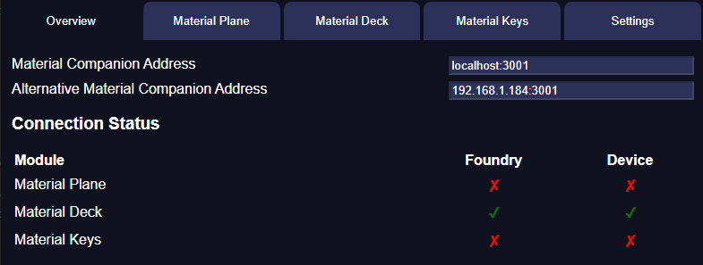

# Overview

The overview tab has 2 sections:

### Top Section
The top section displays the Material Companion address. 
There are 2 variations, the first (`localhost:3001`) should be used in 99% of cases when configuring a module. The second 'Alternative' address is the actual IP address and port which can be used if Material Companion is running on a different computer than the browser you use to access Foundry. This will only work for computers on the same local network.

If your Foundry server is secure, you must use the 'normal' address.

### Connection Status
The connection status section displays the connection status for all supported modules. It displays if the module ('Foundry' column) and the relevant device ('Device' column) are connected. 
For Material Plane the device is the sensor, for Material Deck it is a Stream Deck, for Material Keys it is a Launchpad.

