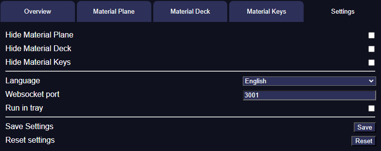

{align=right width=50%}

In the settings tab you can configure some settings for Material Companion:

* Hide Material Plane: Hides the [Material Plane](materialPlane.md) tab
* Hide Material Deck: Hides the [Material Deck](materialDeck.md) tab
* Hide Material Keys: Hides the [Material Keys](materialKeys.md) tab
* Language: Sets the language of Material Companion
* Websocket Port: Sets the websocket port Material Companion will connect to
* Run in Tray: Will run Material Companion in the tray if enabled

After making any changes you have to press `Save` to save the settings. 
To reset the settings back to their default values, press `Reset`.